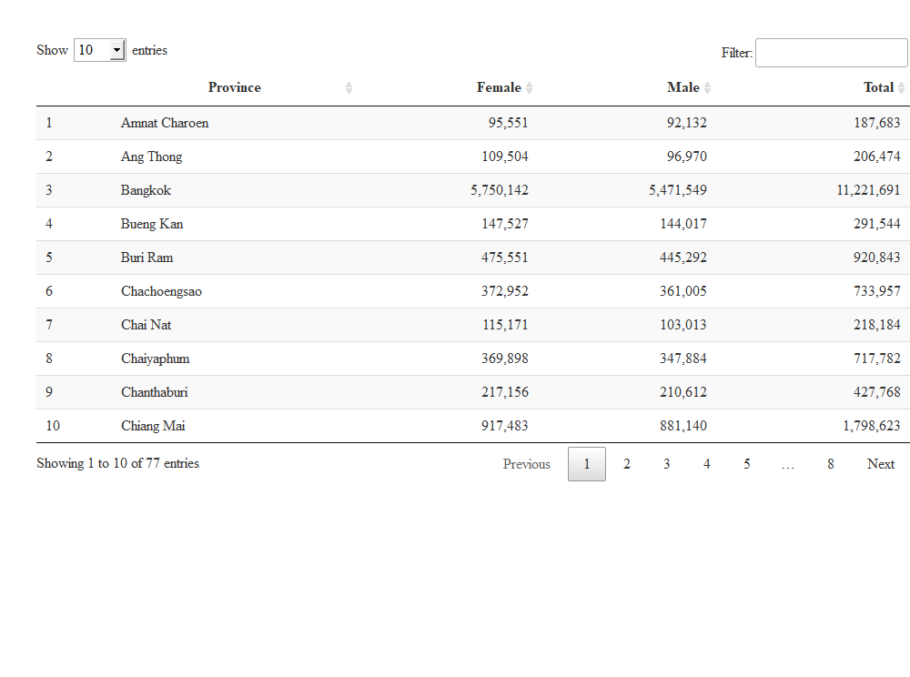

# tables-TStas
tables-TStas created by GitHub Classroom

# 2022 Thailand Province Population Table

The purpose of this table is to display how population varies across the provinces of Thailand. The data used is from 2022.

## Thailand population data for 2022

The Thailand population data came from the same 'Humanitarian Data Exchange' (HDX) source:

<https://data.humdata.org/dataset/cod-ps-tha>

Specifically, I used the 'tha_admpop_adm1_2022.csv' file.

## Load libraries

```{r}
library(tidyverse)
library(dplyr)
library(knitr)
library(kableExtra)
library(DT)
library(htmlwidgets)
```

## Load population data

Load the population data.

```{r}
# read in population data from csv file

thailand_population <- read.csv("C:/Users/tiana/OneDrive/Documents/CSU_STAA_566_Data_Viz/tables-TStas/data/tha_admpop_adm1_2022.csv")
```


Important columns include ADM1_NAME (province name) and T_TL (total population for a district), along with F_TL (female total) and M_TL (male total).

```{r}
# want the ADM1_NAME, F_TL, M_TL and T_TL columns
# Notes on levels of data:
# 0 = country
# 1 = province ** we want level 1
# 2 = district  
# 3 = sub-district
```

Make a new dataframe comprised of the desired columns.

```{r}
# make new dataframe
province_populations <- data.frame(thailand_population$ADM1_NAME, thailand_population$F_TL, thailand_population$M_TL, thailand_population$T_TL)

# rename columns for readability
province_populations <- province_populations %>%
  rename(Province = thailand_population.ADM1_NAME,
         Female = thailand_population.F_TL,
         Male = thailand_population.M_TL,
         Total = thailand_population.T_TL)

# take a look
head(province_populations)

# get dimensions
dim(province_populations)
```

## Make a basic table

First, make a basic table using kable.
```{r}
# kable(province_populations)
```

Now try the same table using kableExtra.
```{r}
# kbl(province_populations)
```

We can sort by Total population, and add a 'header above'.  To improve readability, we can add commas to the numbers, and add styles of 'striped', 'hover', and 'condensed'.
```{r}
# sort by Total population, descending order
sorted_by_total <- province_populations %>% arrange(desc(Total))

# take a look
head(sorted_by_total)

# make table
sorted_by_total_table <- kbl(sorted_by_total, format.args = list(big.mark = ",")) %>%
  add_header_above(c(" ", "Subpopulations" = 2, " "))  %>%
  kable_styling(font_size=12,
                bootstrap_options = c("striped", "hover", "condensed"),
                full_width = FALSE,
                fixed_thead = TRUE) %>%
  scroll_box(width = "100%", height = "400px")
# sorted_by_total_table
```

## Image of kableExtra output


## Use DT framework

Using the DataTables (DT) framework provides another way to generate a dynamic table, and easily allows the user to sort by any of the columns.  Limiting the display to 10 provinces at a time helps with readability.  Sorting by the various columns and only viewing 10 rows at a time provides the user a good overview of the data in a short amount of time (and effort!).
```{r}
options(DT.options = list(pageLength = 10, language = list(search = 'Filter:')))
province_population_DT <- province_populations %>%
  select(Province, Female, Male, Total) %>% datatable(colnames=c("Province","Female","Male","Total")) %>% 
  formatRound('Female', digits = 0) %>%
  formatRound('Male', digits = 0) %>%
  formatRound('Total', digits = 0)

# province_population_DT

# save
# saveWidget(province_population_DT,  file="thailand_province_dynamic_table.html")
```
## Image of DT output 

